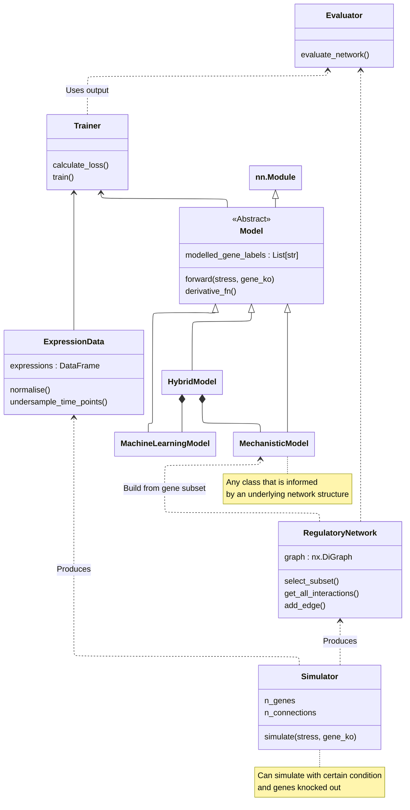

# UML setup for project

```mermaid

---
config:
  look: classic
  layout: elk
  class:
    hideEmptyMembersBox: true
---

classDiagram
    direction BT
    
    %% Classes
    class Trainer{
        calculate_loss()
        train()
    }
    class Model{
        <<Abstract>> 
        modelled_gene_labels : List[str] 
        forward(stress, gene_ko)
        derivative_fn()
    }
    class nn.Module
    class MachineLearningModel
    class MechanisticModel
    class ExpressionData{
        expressions : DataFrame
        normalise()
        undersample_time_points()
    }
    class RegulatoryNetwork{
        graph : nx.DiGraph
        select_subset()
        get_all_interactions()
        add_edge()
    }
    class HybridModel
    class Evaluator{
        evaluate_network()
    }
    class Simulator{
        n_genes
        n_connections
        simulate(stress, gene_ko)
    }

    %% Notes
    note for MechanisticModel "Any class that is informed 
    by an underlying network structure"


    note for Simulator "Can simulate with certain condition 
    and genes knocked out"

    %% Connections
    Model --|> nn.Module
    Model --> Trainer

    MachineLearningModel --|> Model 
    MachineLearningModel --* HybridModel

    MechanisticModel --|> Model
    MechanisticModel --* HybridModel

    HybridModel --|> Model

    RegulatoryNetwork ..> MechanisticModel : Build from gene subset
    RegulatoryNetwork ..> Evaluator

    Trainer ..> Evaluator: Uses output

    ExpressionData --> Trainer

    Simulator ..> ExpressionData: Produces
    Simulator ..> RegulatoryNetwork: Produces

```